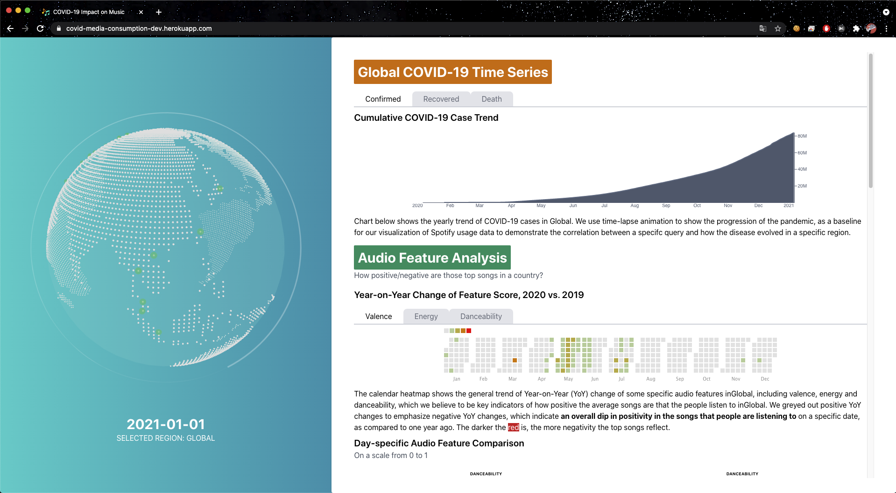

# Project: COVID-19 Impact on Music

## About The Project

This project is under module `CS5346`, National University of Singapore.

Final results are available at [Link](https://covid-media-consumption-dev.herokuapp.com/)




### Project Objectives

The ongoing COVID-19 pandemic has led to major paradigm-shifting changes in our lifestyle that are resulted from constant region lockdown, travel restriction and ever-increasing trends of telecommuting. An unprecedented increase in online content consumption is witnessed worldwide in wake of the disease. 

This project is intended to examine the effects of COVID-19 and the changes in the online music consumption pattern as a whole. In particular, we are interested in analyzing the statistics provided by the online streaming services offering music content, and explaining the correlation between the evolving pandemic and the releases of new contents from the beginning of the outbreak. This project uses various data sources, which comprise the COVID-19 time series trend, Spotify chart history.

## Data Crawing

To craw data from music platforms.

Checkout the crawling scripts within `data-crawler`.

## Web Application

Framework `React`

In order to create a development environment
```
npm ci
npm start
```

## Staging and Deployment

The staging environment is [here](https://covid-media-consumption-dev.herokuapp.com/)
